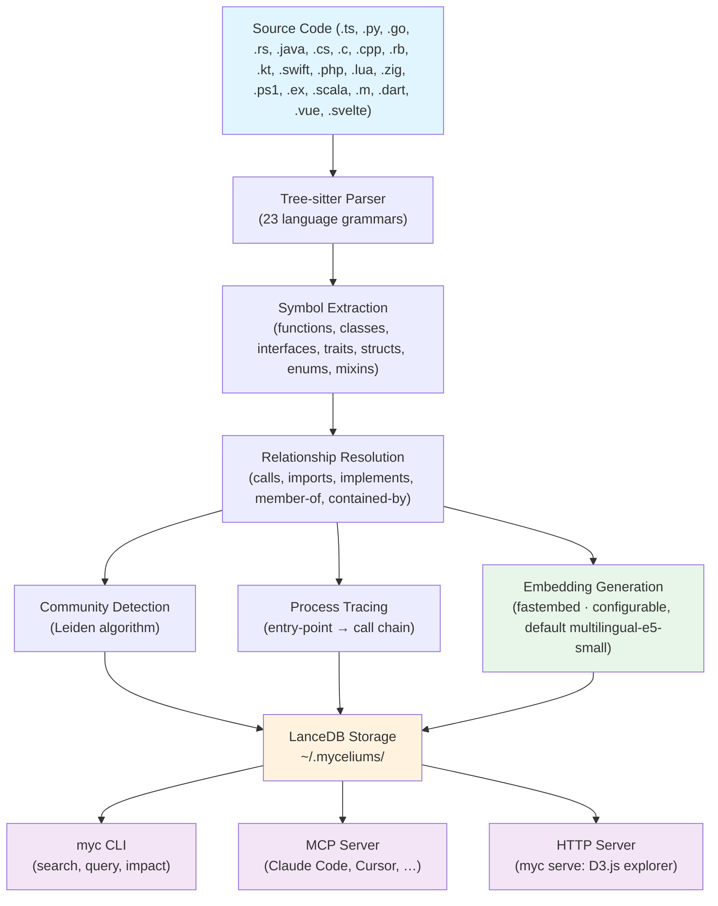

<p align="center">
  
</p>

# Myceliums

[](https://github.com/marcmantei/myceliums/actions)
[](LICENSE)

**The code knowledge graph that gives AI agents structural understanding — not just text search.**

AI coding tools re-read your entire codebase on every task—burning tokens, hallucinating connections, and missing architectural context. Myceliums parses your code into a queryable graph of symbols, call chains, communities, and execution flows. One query replaces thousands of lines of context.

```
$ myc analyze ./my-project

Analyzing /home/dev/my-project ...
  Symbols:       1,247
  Files:          312
  Relationships: 4,891
  Communities:     23
  Processes:       47

Repository ID: my-project-a1b2c3
```

---

## Why Myceliums?

| Without Myceliums | With Myceliums |
|---|---|
| AI grep-searches across hundreds of files | One graph query returns exact results |
| "What calls this function?" → hallucinated guesses | Heuristic caller/callee chains from name-based resolution |
| Full source files sent to AI (thousands of tokens) | Structural summaries (~200 tokens) |
| No understanding of code architecture | Community detection reveals code clusters |
| Manual impact analysis | `myc impact` traces blast radius (with confidence flags) |

### Key capabilities

- **23 languages** — TypeScript, JavaScript, Python, Go, Rust, Java, C#, C, C++, Ruby, Kotlin, Swift, PHP, TSX, Lua, Zig, PowerShell, Elixir, Scala, Objective-C, Dart, Vue, Svelte
- **Content files** — Markdown, MDX, and plain text indexed alongside code (headings as Section symbols, links as References edges)
- **Cypher queries** — Query your codebase like a database: `MATCH (s)-[:CALLS]->(t) RETURN t.name`
- **Token-optimized reviews** — `get_review_context` returns minimal structural summaries instead of full source, reducing AI token usage by 5-20x
- **Interactive visualization** — `myc serve` launches a D3.js force-directed graph explorer in your browser
- **Community detection** — Leiden algorithm automatically discovers code clusters and architectural boundaries
- **Process tracing** — Maps execution flows from entry points through entire call chains
- **Impact detection** — Traces which symbols are affected by your current git diff
- **Symbol rename** — Preview cross-codebase renames before applying
- **Fully local** — No cloud, no telemetry, no API keys. Data stays on your machine.

---

## Quick start

```bash
# Install (pinned to the latest release tag — myc is not on crates.io yet)
cargo install --git https://github.com/marcmantei/myceliums --tag v0.3.2 --locked myc

# Set up Claude Code integration (one-time)
myc setup-claude

# Analyze your project
myc analyze ./my-project

# Start Claude Code — myceliums is ready
claude
```

That's it. Claude Code will automatically use the knowledge graph for code exploration.

For the full walkthrough, see the [Getting Started guide](docs/getting-started.md).

```bash
# Search symbols
myc search "authentication"

# Query the graph with Cypher
myc query 'MATCH (s)-[:CALLS]->(t) WHERE s.name = "login" RETURN t.name'

# Trace execution flows
myc processes my-project --entry "handlePayment"

# Check impact of your changes
myc impact

# Launch interactive graph visualization
myc serve
```

---

## Supported languages

<details>
<summary><strong>23 languages supported (click to expand)</strong></summary>

| Language | Parser | Extracts |
|---|---|---|
| TypeScript | `tree-sitter-typescript` | functions, classes, interfaces, type aliases, enums, imports |
| TSX | `tree-sitter-typescript` | same as TypeScript + JSX components |
| JavaScript | `tree-sitter-javascript` | functions, classes, arrow functions, CommonJS/ESM imports |
| Python | `tree-sitter-python` | functions, classes, decorators, imports |
| Go | `tree-sitter-go` | functions, methods (with receivers), structs, interfaces, goroutines |
| Rust | `tree-sitter-rust` | functions, structs, enums, traits, impl blocks, macros, use trees |
| Java | `tree-sitter-java` | classes, interfaces, enums, records, annotations, generics |
| C# | `tree-sitter-c-sharp` | classes, structs, records, interfaces, properties, namespaces |
| C | `tree-sitter-c` | functions, structs, unions, enums, typedefs, macros, #include |
| C++ | `tree-sitter-cpp` | classes, templates, namespaces, operator overloads, using declarations |
| Ruby | `tree-sitter-ruby` | classes, modules, methods, mixins (include/extend/prepend) |
| Kotlin | `tree-sitter-kotlin-ng` | data/sealed classes, objects, companion objects, extension functions |
| Swift | `tree-sitter-swift` | classes, structs, protocols, enums, extensions, actors |
| PHP | `tree-sitter-php` | classes, interfaces, traits, enums, namespaces, use statements |
| Lua | `tree-sitter-lua` | functions, tables (as modules), require statements |
| Zig | `tree-sitter-zig` | functions, structs, enums, imports |
| PowerShell | `tree-sitter-powershell` | functions, command invocations, module imports |
| Elixir | `tree-sitter-elixir` | modules, functions, macros, use/import/require directives |
| Scala | `tree-sitter-scala` | classes, objects, traits, functions, import statements |
| Objective-C | `tree-sitter-objc` | classes (interfaces), methods, protocols, #import directives |
| Dart | `tree-sitter-dart` | classes, functions, methods, mixins, extensions, enums, imports |
| Vue | `tree-sitter-typescript` (script block) | functions, classes, interfaces, type aliases, enums, imports from `<script>` blocks |
| Svelte | `tree-sitter-typescript` (script block) | functions, classes, interfaces, type aliases, enums, imports from `<script>` blocks |

</details>

**Content files** (built-in line parser, no tree-sitter):

<details>
<summary><strong>Markdown and text files (click to expand)</strong></summary>

| Content type | Extensions | Extracts |
|---|---|---|
| Markdown | `.md`, `.markdown` | headings (H1–H6) as Section symbols, `[text](path)` links as References edges |
| MDX | `.mdx` | same as Markdown; JSX blocks treated as prose |
| Plain text | `.txt` | Document symbol only |
| PDF | `.pdf` | converted to Markdown via `opendataloader-pdf`, then parsed as Markdown (requires `pdf` feature flag and `opendataloader-pdf` CLI) |

</details>

---

## Token-optimized AI reviews

The `get_review_context` MCP tool dramatically reduces token consumption by returning structural summaries instead of full source code:

```
Review context for 3 changed symbols across 2 files:

Changed:
  fn validate_input(req: &Request) -> Result<Input>     src/handler.rs:45
  fn parse_body(body: &str) -> ParseResult               src/parser.rs:12

Callers (affected by this change):
  fn handle_request(req: Request) -> Response             src/handler.rs:10
  fn process_batch(items: Vec<Item>) -> Vec<Result>       src/batch.rs:88

Callees (dependencies):
  fn check_schema(input: &Input) -> bool                  src/schema.rs:30

Communities touched: [request-handling, input-validation]

Token estimate: ~187 tokens (vs ~4,200 for full files — 22x reduction)
```

AI agents get everything they need for a code review in ~200 tokens instead of thousands.

---

## Interactive visualization

Launch an interactive D3.js graph explorer with `myc serve`:

```bash
myc serve              # opens http://localhost:8888
myc serve --port 3000  # custom port
```

**Features:**
- Force-directed graph with zoom, pan, drag
- Nodes colored by community, sized by degree, shaped by kind
- Click any node to inspect: name, kind, file, line, callers, callees
- Toggle edge types: calls, imports, member-of, contained-by
- Search to highlight matching symbols
- Community filtering

---

## Installation

**Cargo (recommended):**

`myc` is not published to crates.io yet, so install it from the git tag of a
release. Pin the tag — installing from the default branch gives you whatever is
on `main` at that moment, which is not reproducible.

```bash
cargo install --git https://github.com/marcmantei/myceliums --tag v0.3.2 --locked myc
```

**From source:**

```bash
git clone https://github.com/marcmantei/myceliums
cd myceliums
cargo install --path myc
```

**Pre-built binaries:**

Download from [GitHub Releases](https://github.com/marcmantei/myceliums/releases).

**Docker:**

```bash
docker run -v $(pwd):/code ghcr.io/marcmantei/myceliums analyze /code
```

The Docker image comes with the fastembed model pre-bundled — no model download on first run. To persist analysis data across runs, mount the data directory:

```bash
docker run -v $(pwd):/code -v ~/.myceliums:/root/.myceliums ghcr.io/marcmantei/myceliums analyze /code
```

### First run

On the very first `myc analyze` or semantic/hybrid search, the configured embedding model is downloaded automatically (a one-time cost — subsequent runs use the cached model). Pre-download it with `myc doctor --download`. The Docker image skips this step since the model is pre-bundled.

---

## Commands

<details>
<summary><strong>Click to expand command reference</strong></summary>

| Command | Description |
|---|---|
| `myc analyze <path>` | Parse a codebase and build its knowledge graph |
| `myc analyze <path> --force` | Force full re-analysis (bypass cache) |
| `myc analyze <path> --skip-embeddings` | Fast analysis without vector embeddings |
| `myc session [path]` | Interactive session setup (checks cache, prompts if needed) |
| `myc serve` | Start the visualization server with interactive graph explorer |
| `myc search <query>` | BM25 full-text search across all symbols |
| `myc search <query> --hybrid` | Hybrid search: BM25 + vector embeddings via RRF |
| `myc semantic-search <query>` | Natural-language semantic search using vector embeddings |
| `myc query <cypher>` | Execute a Cypher query against the knowledge graph |
| `myc communities <repo>` | Show code communities detected by the Leiden algorithm |
| `myc processes <repo>` | Show traced execution flows from entry points |
| `myc impact` | Detect which symbols are affected by the current git diff |
| `myc rename <symbol> <new>` | Preview (or apply with `--apply`) a symbol rename |
| `myc init` | Create a `.myceliums.toml` config in the current directory |
| `myc list` | List all analyzed repositories |
| `myc stats <repo>` | Show symbol, file, relationship, and language breakdown |
| `myc setup-claude` | Set up Claude Code integration (MCP server + hooks) |
| `myc status` | Show overview of all indexed repos, disk usage, and orphaned data |
| `myc clean --orphans` | Remove orphaned data directories not tracked in the registry |
| `myc clean --all` | Remove ALL myceliums data (with confirmation) |
| `myc clean --cache` | Remove the fastembed model cache |
| `myc clean <repo>` | Remove a specific repository's data (with confirmation) |
| `myc doctor` | Verify the installation, check all components, detect orphans and stale locks |
| `myc configure` | View or update global configuration |
| `myc delete <repo>` | Remove a repository's analysis data |

Full command reference: [docs/reference/commands.md](docs/reference/commands.md)

</details>

---

## MCP integration

Myceliums runs as an MCP server over stdio. AI assistants get direct access to the knowledge graph.

### Claude Code (recommended)

```bash
myc setup-claude
```

This registers the MCP server, configures startup indicators, and sets up tool feedback hooks — all in one command. On every Claude Code session you'll see:

```
SessionStart:startup says: [myceliums] my-project ready | 312 files · 1,247 symbols
```

To remove: `myc setup-claude --uninstall`

### Cursor

Add to `~/.cursor/mcp.json`:

```json
{
  "mcpServers": {
    "myceliums": {
      "command": "myc",
      "args": ["mcp"]
    }
  }
}
```

### All supported platforms

One-command setup for 12 platforms:

```bash
myc setup-claude      # Claude Code (MCP + hooks)
myc setup-vscode      # VS Code / Copilot Chat
myc setup-windsurf    # Windsurf (Codeium)
myc setup-zed         # Zed
myc setup-jetbrains   # JetBrains IDEs
myc setup-gemini      # Google Gemini CLI
myc setup-codex       # OpenAI Codex CLI
myc setup-copilot     # GitHub Copilot CLI
myc setup-aider       # Aider
myc setup-kiro        # AWS Kiro IDE
myc setup-continue    # Continue
```

Any other MCP-compatible editor can use myceliums by pointing to `myc mcp`.

**Most-used MCP tools** — the server exposes 54 in total; see the
[MCP tools reference](docs/reference/mcp-tools.md) for the complete list:

| Tool | Description |
|---|---|
| `analyze` | Analyze a codebase (cache-aware, set `force: true` to bypass) |
| `context_search` | BM25 symbol search |
| `hybrid_search` | BM25 + vector search with Reciprocal Rank Fusion |
| `semantic_search` | Vector embedding search for natural-language queries |
| `search_documents` | Full-text search across all code content |
| `symbol_context` | Get a symbol's callers, callees, and definition |
| `cypher_query` | Execute a read-only Cypher query |
| `detect_impact` | Trace the blast radius of a git diff |
| `get_review_context` | Token-optimized structural summary for code reviews |
| `rename_symbol` | Preview a cross-codebase symbol rename |
| `get_processes` | Retrieve traced execution flows with optional filtering |
| `delete` | Remove a repository's analysis data |

---

## Performance

| Codebase size | `--skip-embeddings` | Full (with embeddings) | Cached |
|---|---|---|---|
| Small (< 100 files) | 1-3 seconds | 5-30 seconds | ~50ms |
| Medium (100-1,000 files) | 3-15 seconds | 1-5 minutes | ~50ms |
| Large (1,000-10,000 files) | 15-120 seconds | 10-20 minutes | ~50ms |
| Very large (10,000+ files) | 2-10 minutes | 30+ minutes | ~50ms |

`myc session` uses `--skip-embeddings` by default for fast startup. BM25 text search, Cypher queries, impact detection, and process tracing all work without embeddings. Only semantic/hybrid search requires embeddings.

### Cache-aware analysis

`myc analyze` automatically skips re-analysis when the cache is fresh:

- **Age**: Analysis older than 60 minutes triggers re-analysis (configurable via `--max-age`)
- **Changed files**: More than 50 files changed since last analysis triggers re-analysis
- **Structural files**: Changes to `package.json`, `Cargo.toml`, `tsconfig.json`, or `pyproject.toml` always trigger re-analysis

---

## How search works

Myceliums offers three search modes that combine classical text matching with AI-powered semantic understanding.

### BM25 — keyword search (no AI model)

`myc search` uses [BM25](https://en.wikipedia.org/wiki/Okapi_BM25), a purely mathematical ranking algorithm. It scores documents by term frequency, inverse document frequency, and document length — no machine learning involved. Fast and deterministic, but purely lexical: searching for "car" won't find "vehicle".

### Semantic search — meaning-based (AI model)

`myc semantic-search` converts your query and all code symbols into vectors (embeddings) using an embedding model that runs **locally on your CPU** via [fastembed](https://github.com/Anush008/fastembed-rs) (downloaded once on first use). Symbols with similar meaning land close together in vector space — so "authenticate user" finds `login()`, `verifyCredentials()`, and `checkSession()` even without shared keywords.

The default model is [multilingual-e5-small](https://huggingface.co/intfloat/multilingual-e5-small) (384 dimensions, multilingual — queries in German, French, etc. work against English code). The model is configurable per project via the `[embedding]` section in `.myceliums.toml`:

| Model id | Dim | Multilingual | Notes |
|---|---|---|---|
| `multilingual-e5-small` | 384 | ✓ | Default — best size/quality balance |
| `multilingual-e5-base` | 768 | ✓ | Higher quality, larger download |
| `multilingual-e5-large` | 1024 | ✓ | Maximum quality, ~2 GB download |
| `jina-embeddings-v2-base-code` | 768 | — | Code-specialized, English queries |
| `all-minilm-l6-v2` | 384 | — | Legacy default, English only |

Alternatively, set `provider = "openai-compatible"` to use any server speaking the OpenAI embeddings API (Ollama, LM Studio, TEI, vLLM, or a cloud provider) — see [Project config](#project-config).

**Why the same model matters:** Each embedding model defines its own vector space. Queries and documents must be embedded with the same model — mixing models produces meaningless similarity scores. Myceliums records the model inside each index and always queries with that model; switching models in the config takes effect on the next full `myc analyze`, which rebuilds the vectors.

Vectors are stored in [LanceDB](https://lancedb.com/), an embedded vector database (no server required). For repositories with more than 10,000 symbols, an approximate nearest neighbor (IVF-PQ) index is built automatically.

### Hybrid search — best of both worlds

`myc search --hybrid` runs BM25 and semantic search in parallel, then merges results using [Reciprocal Rank Fusion](https://plg.uwaterloo.ca/~gvcormac/cormacksigir09-rrf.pdf) (RRF, k=60). This catches both exact keyword matches and semantically related symbols. A cross-encoder reranker (default: the multilingual [bge-reranker-v2-m3](https://huggingface.co/BAAI/bge-reranker-v2-m3), configurable via `[embedding] reranker`) optionally re-scores the top candidates for higher accuracy.

### When to use which

| Mode | Command | Speed | Best for |
|---|---|---|---|
| BM25 | `myc search` | Instant | Exact names, known symbols |
| Semantic | `myc semantic-search` | Fast | Natural-language questions, concept search |
| Hybrid | `myc search --hybrid` | Fast | General-purpose — recommended default |

> **Embeddings are optional.** BM25 search, Cypher queries, impact detection, and process tracing all work without embeddings. Use `--skip-embeddings` during analysis for faster startup when semantic search isn't needed.

---

## Architecture



**Data stays on your machine.** No cloud, no telemetry, no API keys required.

---

## Project config

Run `myc init` in any project directory to create a `.myceliums.toml` config file:

```toml
[project]
name = "my-app"

[analysis]
include = ["src/**"]
exclude = ["node_modules/**", "vendor/**"]
max_file_size_kb = 512

[process]
entry_points = ["main", "handleRequest"]

[community]
min_community_size = 3
resolution = 1.0

[embedding]
# Local ONNX model from the curated registry (see `myc doctor` for the list)
provider = "local"
model = "multilingual-e5-small"
reranker = "bge-reranker-v2-m3"
```

To use your own embedding server instead of the bundled local models, point the `openai-compatible` provider at any server speaking the OpenAI embeddings API:

```toml
[embedding]
provider = "openai-compatible"
model = "nomic-embed-text"
base_url = "http://localhost:11434/v1"   # e.g. Ollama
dim = 768                                 # the model's vector dimension
api_key_env = "MYCELIUMS_EMBEDDING_API_KEY"  # env var holding the key (if any)
```

The embedding model determines the vectors stored in the index, so it lives in the project config (committed, shared by the team). Changing it takes effect on the next full `myc analyze`.

---

## Data management

All analysis data is stored locally at `~/.myceliums/`:

```
~/.myceliums/
├── repos.json           # Registry of all analyzed repositories
├── data/                # Per-repo LanceDB databases
│   ├── my-project-a1b2c3/
│   └── other-repo-d4e5f6/
└── snapshots/           # Graph snapshots for diff comparisons
```

**Check your data usage:**

```bash
myc status
```

Shows all indexed repos, file/symbol counts, disk usage per repo, orphaned directories, and model cache size.

**Clean up data:**

```bash
myc clean --orphans      # Remove orphaned data dirs
myc clean my-project     # Remove a specific repo (with confirmation)
myc clean --cache        # Remove the fastembed model cache
myc clean --all          # Remove everything (with confirmation)
myc clean --orphans --yes  # Skip confirmation prompts
```

**Diagnose issues:**

```bash
myc doctor               # Checks registry, data integrity, orphans, stale locks
```

### Branch checkout behavior

Analysis is keyed by repository path, not branch. When you switch branches, the next `myc session` or `myc analyze` detects changed files via `git diff` and automatically re-indexes. The existing LanceDB data for that repo path is overwritten — there is no per-branch storage.

### How orphaned data happens

If an analysis is interrupted (e.g., timeout, crash, `Ctrl+C`), the data directory may be created but the registry entry not written. These "orphaned" directories are invisible to `myc list` but consume disk space. Use `myc status` to detect them and `myc clean --orphans` to remove them.

---

## Resource usage and safety

### Safety guards (enabled by default)

| Guard | Behavior |
|-------|----------|
| **Home directory** | Refuses to analyze `~/` — would index hundreds of thousands of files |
| **Git repository** | Requires `.git/` directory (override with `--no-git-check`) |
| **Lock file** | Prevents two analyses of the same repo from running simultaneously |
| **Timeout** | `--timeout 300` (5 minutes) in auto mode — aborts gracefully on timeout |


### Claude Code integration

`myc setup-claude` configures two things:

1. **MCP server** — Registered in `~/.claude.json`. Claude Code spawns `myc mcp` as a background process for each session. Lightweight and idle when not queried.
2. **SessionStart hook** — Added to `~/.claude/settings.json`. Runs `myc session . --yes --timeout 300` when a Claude Code session starts, ensuring the knowledge graph is fresh. Aborts after 5 minutes to prevent runaway analyses.

To remove the integration: `myc setup-claude --uninstall`

---

## Contributing

Contributions are welcome. Please open an issue before starting significant
work, and review the [Contributing guide](CONTRIBUTING.md), the
[Code of Conduct](CODE_OF_CONDUCT.md), and the [Roadmap](ROADMAP.md) first.

```bash
git clone https://github.com/marcmantei/myceliums
cd myceliums
cargo build --workspace
cargo test --workspace
cargo clippy --workspace -- -D warnings
```

The workspace has seven crates:

| Crate | Purpose |
|---|---|
| `myceliums-core` | Parsing (23 languages), symbol extraction, search, graph algorithms |
| `myceliums-storage` | LanceDB-backed persistence layer |
| `myceliums-mcp` | MCP server implementation |
| `myceliums-cypher` | Cypher query parser and executor |
| `myceliums-http` | Axum HTTP server for visualization |
| `myceliums-benchmarks` | Benchmark harness and retrieval-quality measurement |
| `myc` | CLI binary |

---

## Documentation

| Topic | Link |
|-------|------|
| Getting started | [docs/getting-started.md](docs/getting-started.md) |
| Editor setup (all 14 editors) | [docs/editors/overview.md](docs/editors/overview.md) |
| Call resolution limitations | [docs/guides/call-resolution-limitations.md](docs/guides/call-resolution-limitations.md) |
| Token savings | [docs/guides/token-savings.md](docs/guides/token-savings.md) |
| Cypher query guide | [docs/guides/cypher-queries.md](docs/guides/cypher-queries.md) |
| Search modes | [docs/guides/search-modes.md](docs/guides/search-modes.md) |
| Large codebases | [docs/guides/large-codebases.md](docs/guides/large-codebases.md) |
| Non-git projects | [docs/guides/non-git-projects.md](docs/guides/non-git-projects.md) |
| CLI reference | [docs/reference/commands.md](docs/reference/commands.md) |
| MCP tools reference | [docs/reference/mcp-tools.md](docs/reference/mcp-tools.md) |
| Configuration | [docs/reference/config.md](docs/reference/config.md) |
| Data management | [docs/reference/data-management.md](docs/reference/data-management.md) |
| FAQ | [docs/faq.md](docs/faq.md) |
| Roadmap | [ROADMAP.md](ROADMAP.md) |

---

## Project status

Myceliums is a personal project, maintained on a best-effort basis. It is used
in real work and the test suite and CI gates are taken seriously, but there is
no company behind it and no support commitment.

Practically, that means: issues may not get a timely response, pull requests may
take weeks to review, and the [ROADMAP](ROADMAP.md) is a direction of travel
rather than a promise. Bug reports with a reproduction are genuinely welcome.
Before starting significant work on a PR, please open an issue first so we can
agree on the approach — see [CONTRIBUTING.md](CONTRIBUTING.md).

## License

Apache-2.0 -- see [LICENSE](LICENSE).
